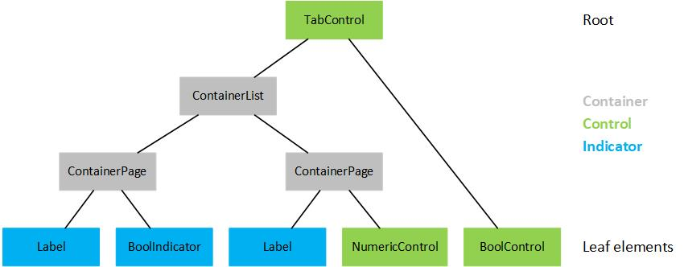
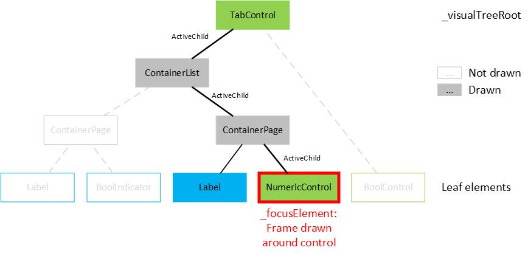
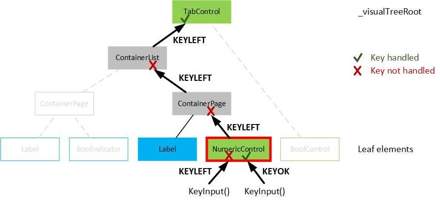

# UI_Lib

This is a user interface library for graphical LCDs. 
It offers many different controls and indicators that can be nested depending on the element types. 
This Readme gives an overview of the available components, the usage of the library and some implementation details.

The library uses a Visual Tree concept that is similar to the C# WPF UI organization. 
There is always one single tree root element that has nested children. 
There are UI elements that can have multiple children (e.g. pages) or elements that are "leaf" elements not supporting nested children (e.g. numeric controls).



## Initialization / Setup
The Adafruit GFX library is used for LCD handling:

[GitHub - adafruit/Adafruit-GFX-Library](https://github.com/adafruit/Adafruit-GFX-Library)

To initialize the UI_Lib:
- Create an Adafruit display object depending on the used display.
- Init the display object accordingly.
- Call the `UiManager.Init` function of the `UI_Manager` (use the `UiManager` instance delivered with the library) with the created Adafruit_GFX object. 
- Configure the colors you want to use with the `UiManager.SetColors` method. It is also possible to set the colors individually with the `UiManager.ColorBackground`, `UiManager.ColorForeground` and `UiManager.ColorForegroundEditMode` properties.
- Configure the font you want to use with the `UiManager.SetFont` method.

At this point, nothing is displayed yet. There is no visual tree assigned (and created) that can be shown, so create one:
- Create objects of all UI elements that you want to use to build the user interface.
- Link all objects to their parent objects (e.g. add a numeric control to the item collection of a page, add the page to a tab control, ...) by using the appropriate functions of the parent controls.
- Connect the root of the visual tree to the `UI_Manager` by using the `UiManager.ChangeVisualTreeRoot` method.
- Call the `UiManager.Draw` method with the previously created display object. You can also draw to a canvas here.

Now the user interface is shown but no user inputs are processed. You have to feed the `UiManager.KeyInput` function whenever a key was pressed. Rotary encoder inputs should also be encoded as key presses (KEYUP, KEYDOWN, KEYOK).

## Available components
This section lists all available UI elements (containers, controls, indicators). Base classes are not listed here.

### Containers
- ContainerList: This container can be used to show one children at a time. The user can scroll though all items one by one. A scroll bar is indicating the position of the currently shown item in the list of items.  
	- Supports children: Yes (adding with `ContainerList::AddItem` function)
	- Supported user inputs: 
		- KEYUP and KEYDOWN to scroll though the items. 
- ContainerPage: This container can be used to show all children at the same time. This can be used to draw e.g. multiple controls and indicators on the same page.
	- Supports children: Yes (adding with `ContainerPage::AddItem` function)
	- Supported user inputs: 
		- KEYUP and KEYDOWN to select the next/previous control in the list of items. Indicators are ignored (not selected).
- ContainerGrid: This container can be used to show all children at the same time in a grid layout.
	- Supports children: Yes (adding with `ContainerGrid::AddItem` function)
	- Supported user inputs: 
		- KEYUP and KEYDOWN to select the next/previous control in the list of items. Indicators are ignored (not selected).
- ContainerStack: This container can be used to show all children at the same time stacked horizontal or vertical.
	- Supports children: Yes (adding with `ContainerStack::AddItem` function)
	- Supported user inputs: 
		- KEYUP and KEYDOWN to select the next/previous control in the list of items. Indicators are ignored (not selected).

### Controls
- BoolControl: This control can be used to toggle the value of an boolean variable. 
	- Supports children: No
	- Supported user inputs: 
		- KEYOK to toggle the boolean value.
- ButtonControl: This control can be used to display a button that the user can press. When pressed, a callback function is executed.
	- Supports children: No
	- Supported user inputs: 
		- KEYOK to press the button and execute the callback function.
- EnumControl: This control can be used to choose a value from an enumeration.
	- Supports children: No
	- Supported user inputs: 
		- KEYOK to toggle between edit and display mode. 
		- KEYUP and KEYDOWN to change to the next/previous enumeration value (only supported in edit mode).
- MessageDialog: This control can be used to show a message dialog including a severity icon (info, warning, error), a message text and 0, 1 or 2 buttons (OK, Cancel).
	- Supports children: No
	- Supported user inputs: The user inputs are internally redirected to the ContainerPage that is managing the buttons.
- NumericControl: This control can be used to change the value of a numeric variable.
	- Supports children: No
	- Supported user inputs: 
		- KEYOK to toggle between edit and display mode. 
		- KEYLEFT and KEYRIGHT to move the cursor left/right (only supported in edit mode).
		- KEYUP and KEYDOWN to increase/decrease the digit at the cursor position (only supported in edit mode).
		- KEYKILO, KEYMILLI to change to kilo (*1000) or milli (/1000) of the current value (only supported in edit mode).
		- KEYCOMMA is used as x1 key at the moment (change to the base unit, *1) (only supported in edit mode).
		- KEYMINUS to toggle from positive to negative value (only supported in edit mode).
		- KEY0 to KEY9 to change the value of the digit at the cursor position to the corresponding value (only supported in edit mode).
- TabControl: This control can be used to show a tab control with each tab page holding one UI element.
	- Supports children: Yes (adding with TabControl::AddTab function)
	- Supported user inputs:
		- KEYLEFT and KEYRIGHT to go to the previous/next tab page. 

### Indicators
- BoolIndicator: This indicator can be used to display the value of an boolean variable ("ON" or "OFF"). 
	- Supports children: No
- EnumIndicator: This indicator can be used to display the value from an enumeration variable.
	- Supports children: No
- Icon: This indicator can be used to show an icon on the user interface. The icons must be in the .xbm format and located in the program memory (using the PROGMEM attribute).
	- Supports children: No
- Label: This indicator can be used to show a string on the user interface. The Label supports multiline strings (containing line breaks) and different fonts.
	- Supports children: No
- NumericIndicator: This indicator can be used to display the value of a numeric variable. The value is displayed in prefixed format is possible (e.g. 1000 is displayed as 1k)
	- Supports children: No
- ProgressBar: This indicator can be used to display a progress bar. It supports different fill modes (origin left, origin right, origin zero) and ticks.
	- Supports children: No

## Adding a new component
Before adding a new component, decide if it will be a container, control or indicator. Then create new .cpp and .h files in the corresponding folder inside the `UI_Lib` folder.
Also add an include for the .h file to the `UI_Elements.h` file.

### .h file
All user interface elements must be derived from the `UIElement` class that contains some common parameters like location and size of the element. This class also requires the new element to implement a `UI_Manager::Draw` function that is used to display the element on screen. Also a `UI_Manager::KeyInput` function is defined that can be implemented optional (for controls, indicators don't need user interaction).

The following code snippet shows an example class declaration for an new empty UI element (control).
```C++
#ifndef NEWCONTROL_H_
#define NEWCONTROL_H_
#include "../Core/UIElement.h"

class NewControl : public UIElement
{
protected:
	bool* _valuePointer;
	bool _valueDraw;

public:
	NewControl(unsigned char locX, unsigned char locY, bool* valuePointer);
	virtual void Draw(Adafruit_GFX* gfx) override;
	virtual bool KeyInput(Keys_t key) override;
};

#endif /* NEWCONTROL_H_ */ 
```

### .cpp file

The following code snippet shows an example class definition for the new empty UIElement (control) from above.

Call the `UIElement` constructor from this constructor and decide if the element is a container, control or indicator.
In the `UI_Manager::KeyInput` function handle each key that is supported by the element and return true to indicate that the key was handled. If you return false from `UI_Manager::KeyInput` function, the key is propagated to the parent element by the UI_Lib Core.

```C++
#include "NewControl.h"

NewControl::NewControl(unsigned char locX, unsigned char locY, bool* valuePointer) : UIElement(locX, locY, UI_CONTROL)
{
	// Do further constructor tasks here
}

void NewControl::Draw(Adafruit_GFX* gfx)
{
	if (Visible)
	{
		// Draw the UI element using the Adafruit_GFX functions
	}
}

bool NewControl::KeyInput(Keys_t key)
{
	switch (key)
	{
		case KEYOK:
			// Handle all keys that the UI element supports here and return true, if the key was handled
			return true;
		default:
			// Return false if the key wasn't handled. Then it gets propagated to the parent element
			return false;
	}
}
```

## Core Implementation details
This section gives a short overview of the `UI_Manager` implementation.

There are two private variables:
- `UI_Manager::_visualTreeRoot`: This is the entry point into the visual tree (representing the layout of the user interface). It can be any object of type UIElement (no matter if it is a container, control or indicator).
- `UI_Manager::_focusElement`: Each `UIElement` has a property `UIElement::ActiveChild` which is a pointer to the active child element of the element. Only elements with children use this property to track which item should be displayed or operated. Simple controls and indicators (without children support) have set this property to NULL (they are called leaf elements). The `UI_Manager::_focusElement` is found by traversing down the visual tree trough all active childs until an element without a child (`UIElement::ActiveChild == NULL`, leaf element) is reached.

### Drawing
If the visual tree root of the `UI_Manager` is NULL (not set by `UI_Manager::ChangeVisualTreeRoot`) nothing is drawn by the `UI_Manager::Draw` function.

Otherwise a frame is drawn around the `UI_Manager::_focusElement` (only if it is visible and is no indicator). Then the `UI_Manager::Draw` function of the `UIElement` assigned to `UI_Manager::_visualTreeRoot` is called. The element draws itself and (if it's not a leaf element, e.g. if it's a container) calls the `UI_Manager::Draw` functions of one or multiple child elements (depending on the container type). These child elements also draw themselves and possible further child elements. So the visual tree is traversed down until no child elements are left.



### Key Input Handling
If the `UI_Manager::KeyInput` function is called, the received key is first send to the `UI_Manager::KeyInput` function of the `UI_Manager::_focusElement`. If this function returns true, the key was handled (and supported) by the control and nothing has to be done. If the function returns false, the key wasn't handled (not supported or no `UI_Manager::KeyInput` function wasn't defined like with indicators). The key is then send to the `UI_Manager::KeyInput` function of the parent element of the `UI_Manager::_focusElement`. If this returns true nothing must be done, otherwise the key is again send to the parent element. The key bubbles up the tree until the key is handled or the root of the visual tree is reached.

After each key input, the `UI_Manager::_focusElement` is recalculated.



## Example
```C++
#include "Core/UI_Manager.h"
#include "Core/UI_Elements.h"

bool boolVal1;
Label<10> labelBool("Boolean");
BoolIndicator boolInd1(&boolVal1);
BoolControl boolCtrl1(&boolVal1, &boolVal1);
ContainerStackDefault stack_boolean;

// Call this method to build a simple Visual Tree and attach it to the UI_Manager
void UI_Test_BuildTree()
{
	stack_boolean.AddItem(&labelBool);
	stack_boolean.AddItem(&boolInd1);
	stack_boolean.AddItem(&boolCtrl1);
	stack_boolean.InitItems();
	UiManager.ChangeVisualTreeRoot(&stack_boolean);
}

// Call this method from outside to initialize the UI_Lib
void UI_Test_Init(Adafruit_GFX* gfx)
{
	UiManager.Init(gfx);
}

// Call this method to redraw the screen
void UI_Test_Draw(Adafruit_GFX* gfx)
{
	UiManager.Draw(gfx);
}

// Call this method to send user inputs (keys, encoder actions) to the UI_Manager
void UI_Test_KeyInput(Keys_t key)
{
	UiManager.KeyInput(key);
}
```

A more detailed example can be found in `UI_Lib_Test.cpp`